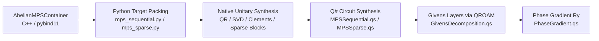

# MPS Unitary Synthesis and Native Preprocessing Design

This note describes the classical matrix preprocessing used by the sequential
and sparse MPS state-preparation methods. The numerical decomposition kernels
are implemented in the private C++ `unitary_synthesis` module and exposed
through `_core._algorithms`; the remaining full-pipeline API is not yet a
public contract.

## 1. Architecture Overview



| Layer | Source | Responsibilities |
|---|---|---|
| C++ data model | `abelian_mps_wavefunction.hpp`, pybind binding | Block-sparse `AbelianMPSSite` (symmetry-blocked tensor slices), `AbelianMPSContainer` (chain + metadata). Dense conversion via `to_dense()`. |
| Python preprocessing | `mps_sequential.py`, `mps_sparse.py` | Target packing, result dataclasses, Q# register remapping, and serialization |
| C++ unitary synthesis | `unitary_synthesis.hpp`, `unitary_synthesis.cpp` | Complete QR, two-block CSD, three-step site peel, Clements factorization, block-layer merging, sparse rectangles, permutations, and null-space completion |
| Q# circuit | `MPSSequential.qs`, `MPSSparse.qs`, `GivensDecomposition.qs` | Angle quantization, QROAM loading, phase-gradient rotation, permutation via Select+SWAP |

---

## 2. Index Conventions & Tensor Layout

### 2.1 C++ Dense Packing

`AbelianMPSSite::to_dense()` → `Eigen::MatrixXd` of shape `(left * physical, right)`.

Row `(l * d + p)` stores $A^p[l,r]$, i.e., **left-major, physical-minor**.

### 2.2 Python (NumPy) Convention

MPS tensor `T` has shape `(chi_left, d, chi_right)` — **left, physical, right**.

Dense conversion from `AbelianMPSSite` object (`to_dense()` in pybind) returns `(left, physical, right)` via `unpack_dense`.

### 2.3 Target Isometry Construction (Sequential)

```python
target = tensor.transpose(1, 2, 0)  # (d, chi_right, chi_left)
# Apply v_from_next on right-bond index (axis 1):
target = np.einsum("ij,djk->dik", v_from_next, target)  # (d, dim, left)
padded = np.pad(target, ((0,0),(0,dim-target.shape[1]),(0,0)))  # (d, dim, left)
matrix = padded.reshape(d*dim, left)  # U' isometry
```

Thus the target isometry $U' \in \mathbb{R}^{4\chi \times \chi_L}$ has block structure:
$$U' = \begin{pmatrix} A_0 \\ A_1 \\ A_2 \\ A_3 \end{pmatrix}, \quad A_p = (M^p)^T \in \mathbb{R}^{\chi \times \chi_L}$$

where $M^p = T[:, p, :]$ is the $p$-th physical slice of the tensor.

### 2.4 Target Matrix (Sparse)

```python
# For each physical p: take tensor[:, p, :].T → (chi_right, chi_left), pad to (ancilla_dim, chi_left)
# Stack vertically: (4*ancilla_dim, chi_left)
```

Row index = `p * ancilla_dim + a` in the target matrix (physical-major, ancilla-minor).

### 2.5 Native Packing Without the 3-D Round Trip

The public native dense representation and the synthesis workspace have
different linearizations:

$$D_{ld+p,r}=A^p_{l,r}, \qquad T_{p\chi+r,l}=A^p_{l,r}.$$

Consequently, the required target is not a zero-copy transpose or `Eigen::Map`
of `AbelianMPSSite::to_dense()`: it also contains a perfect shuffle between the left
and physical indices. Calling `to_dense()`, unpacking it to `(left, physical,
right)`, transposing, padding, and reshaping performs avoidable copies.

The native implementation should allocate the final column-major workspace
$T\in\mathbb{R}^{d\chi\times\chi_L}$ once, initialize it to zero, and copy
each native symmetry block directly into its destination:

```cpp
target.block(
    physical * ancilla_dim + right_offset,
    left_offset,
    block->cols(),
    block->rows()) = block->transpose();
```

Here a physical-slice block has shape `(left_extent, right_extent)`. This packs
only the stored nonzero blocks, lands in the exact matrix consumed by QR and
SVD, and includes power-of-two padding at no extra cost. If a propagated right
factor $V$ is present, compute each physical output block as

$$T_p = V\,A_p^T$$

directly into the same workspace. Do not first build an untransformed packed
matrix. The first-site vector can likewise be filled directly from its physical
slices, so the sequential native path never needs a 3-D tensor.

This is a one-pack design rather than a zero-copy design. QR and SVD require a
contiguous mutable matrix and generally overwrite or copy their input, so one
final-layout materialization per site is the useful lower bound. The existing
`to_dense()` layout should remain unchanged because it is a public data-model
contract used outside synthesis.

### 2.6 Q# Register Convention

The Q# register `newSite + ancilla = [q0, q1] + [anc_{n-1}, ..., anc_0]` encodes:

- Register value $v = \text{physical} + \text{ancilla} \times d$ (little-endian: `physical = v % d`, `ancilla = v // d`)
- MSB-first target for Givens: `target[0]` = MSB of state value

The `_remap_perm_to_qsharp_order` function conjugates permutations between these conventions:

- Target matrix: row = `p * ancilla_dim + a`  
- Q# value: `v = p + a * d`

---

## 3. Sequential Decomposition (CSD)

### 3.1 Three-Step Peeling (Appendix B, Rupprecht 2026)

Given isometry $U' = [A_0; A_1; A_2; A_3]$ of shape $(4\chi, \chi_L)$:

**Step 1:** QR on lower 3 blocks $[A_1; A_2; A_3] = B \cdot R$, $B \in \mathbb{R}^{3\chi \times 3\chi}$, $R \in \mathbb{R}^{3\chi \times \chi_L}$. Split $B = [B_2; B_3 \| B_4]$ where $B_2$ is the top $\chi$ rows.

**Step 2:** QR on $[B_3; B_4] = C \cdot S$, $C \in \mathbb{R}^{2\chi \times 2\chi}$, $S \in \mathbb{R}^{2\chi \times \chi}$.

**Step 3:** Three `decompose_2d` calls (bottom→top):

1. $[C_3; C_4]$ → $(U_2, U_3, D_2, D_2', V'')$
2. $[B_2; S]$ → $(U_1, U_{\text{dummy}}, D_1, D_1', V')$
3. $[A_0; R]$ → $(U_0, U_{\text{top}}, D_0, D_0', V)$

### 3.2 `decompose_2d` Identity

For $[a; b]$ with orthonormal columns ($a \in \mathbb{R}^{m \times k}$):

$$\begin{pmatrix} a \\ b \end{pmatrix} = \begin{pmatrix} U_1 & 0 \\ 0 & U_2 \end{pmatrix} \begin{pmatrix} D_1 \\ D_2 \end{pmatrix} V$$

where $D_1^2 + D_2^2 = I_k$ (CS decomposition). Writing the thin SVD

$$a = U_1 C V^T$$

and defining $X=bV$, the isometry condition gives

$$X^T X = V^T b^T b V = I-C^2.$$

Therefore the columns of $X$ are orthogonal and their norms are the sine
diagonal

$$S = \sqrt{I-C^2}, \qquad b = U_2 S V^T.$$

For $S_{jj}>0$, column $j$ of $U_2$ is $X_{:j}/S_{jj}$; zero columns are
completed to an orthonormal basis. This is the numerical identity the native
implementation should target.

**Reference Python algorithm:**

1. SVD: $a = U_1 \Sigma_1 V^T$, with $D_1=\Sigma_1$.
2. Form $X=bV$ and compute another SVD $X=W\Sigma_2 Z^T$.
3. Construct an approximate $U_2$ from $W$ and $Z^T$, and return the diagonal
    of $Z\Sigma_2Z^T$ as $D_2$.

The production path now performs this decomposition in C++ with complete Eigen
SVD factors and a polar completion of the lower block. Native tests reconstruct
rectangular and rank-deficient inputs and verify $C^2+S^2=I$. The Python helper
remains as a thin binding wrapper for compatibility and focused tests.

### 3.3 Circuit Order (Fig. 5)

Applied right-to-left on quantum register:

$$V \to \text{UCR}(D_0') \to \text{CNOT}(q_1, q_0) \to W_0 \to \text{UCR}(D_1') \to \text{CNOT}(q_1, q_0) \to W_1 \to \text{UCR}(D_2') \to U$$

Where:

- $V$ is absorbed into the previous site (never applied as a circuit element)
- UCR angles: $\theta_k = 2\arcsin(D'_j[k])$
- $W_0 = V' \cdot U_{\text{top}}$, $W_1 = V'' \cdot U_{\text{dummy}}$
- $U = \text{diag}(U_0, U_1, U_2, U_3)$ block-diagonal

### 3.4 V Absorption (Backward Propagation)

Sites are processed in **reverse** order. Site $i$'s $V$ matrix modifies site $i-1$'s target via:

```python
target = np.einsum("ij,djk->dik", v_from_next, target)
```

This is $V$ acting on the right-bond (ancilla) dimension. For the first site, $V$ is absorbed into the initial state vector: `init_padded = init_padded @ v_pad.T`.

---

## 4. Givens Factorization (Clements Double-Sided)

### 4.1 Algorithm

Decomposes orthogonal $M \in O(\chi)$ as:
$$M = D \cdot L_{\chi} \cdots L_1$$

where each $L_j$ is a layer of parallel 2×2 $R_y(\theta)$ rotations on adjacent pairs, alternating even (0-1, 2-3, ...) and odd (1-2, 3-4, ...) parity.

**Implementation** (lines 855–940):

- Even iterations $k$: right-column elimination (apply rotation to columns)
- Odd iterations $k$: left-row elimination (apply rotation to rows)
- Lower (left-side) rotations are commuted past $D$ to become right-side: angle adjusted by $\text{sign}(D[p] \cdot D[p+1])$
- Produces exactly $\chi$ layers for $\chi \times \chi$ matrix

### 4.2 Block-Diagonal Merge

For $U = \text{diag}(U_0, U_1, U_2, U_3)$ of total dimension $4\chi$:

- Each block decomposed independently → $\chi$ layers each
- Layers merged into global layers by parity alignment: block at offset $O$ with local `shifted=S` fits global `shifted=G` iff $(O + S) \bmod 2 = G \bmod 2$
- Worst case: $\chi$ global layers (blocks scheduled in parallel)

### 4.3 Angle Convention

Givens $R_y(\theta)$:
$$G(\theta) = \begin{pmatrix} \cos\theta & -\sin\theta \\ \sin\theta & \cos\theta \end{pmatrix}$$

Q# quantization: `RyViaPhaseGradient` applies $R_y(4\pi x / 2^b)$. To get $R_y(2\theta)$:
$$x = \lfloor \theta \cdot 2^b / (2\pi) \rceil$$

UCR quantization: standard $R_y(\alpha)$ → $x = \lfloor \alpha \cdot 2^b / (4\pi) \rceil$

---

## 5. Sparse Decomposition ($U = P_{\text{row}} \cdot V_{\text{block}} \cdot P_{\text{col}}$)

### 5.1 Algorithm (Rupprecht 2026, Section 3)

1. **Build target matrix** $(4\chi, \chi_L)$ in CSC sparse format
2. **Extract rectangles**: walk columns left-to-right grouping by shared nonzero rows → chained rectangular blocks with row permutation
3. **Column permutation**: relocate columns from right side to make each rectangle square → block-diagonal form
4. **Null-space completion**: expand each rectangle to full unitary
5. **Order blocks** (largest first) → compose final permutations
6. **Givens decomposition** of block-diagonal

In matrix form, the permutations are chosen so that the padded site isometry
$A$ is represented by

$$A = P_{\mathrm{row}}\,\operatorname{diag}(B_0,\ldots,B_{s-1},I)\,P_{\mathrm{col}}\,E,$$

where $E$ selects the input columns from the square active space and each
$B_j$ is a square orthogonal completion of one extracted rectangle. The Q#
circuit applies the column permutation, block unitary, and row permutation in
that order. Because the in-memory target uses row $p\chi+a$ while Q# uses
value $p+da$, both permutations are conjugated by this reindexing before
serialization.

### 5.2 Required Isometry Precondition

The sparse path decomposes every site independently and does not propagate a
right factor into the preceding tensor. It therefore requires each padded site
map to already have orthonormal columns:

$$\lVert A_i^T A_i-I\rVert \leq \varepsilon.$$

For an MPS this normally follows from the appropriate canonical form. The
current Python path neither canonicalizes nor checks this condition. Treat this
as an unresolved input-contract issue: add a residual check first, then decide
whether the public algorithm rejects noncanonical input or canonicalizes a copy.

### 5.3 Permutation Implementation

Q# `PermutationViaQROAM`:

1. `Select(P, addr, loaded)` — load $P(i)$ into fresh register
2. `SWAP(target, loaded)` — swap registers
3. `Select(P^{-1}, target, loaded)` — uncompute via XOR with inverse: `loaded = i ⊕ i = 0`

Cost: 2× Select + $n$ SWAPs ≈ $2(N-1)$ Toffoli + $n$ SWAP.

---

## 6. Asymptotic Costs

Let $\chi$ = bond dimension, $n$ = number of sites, $d = 4$ physical dimension, $b$ = rotation bits.

### 6.1 Sequential (Dense) Per-Site Cost

| Component | Givens Layers | QROAM per Layer | Total Toffoli |
|---|---|---|---|
| V (absorbed) | 0 | 0 | 0 |
| UCR × 3 | — | $\chi/2 - 1$ each | $3(\chi/2 - 1)$ |
| W₀ (controlled) | $\chi$ | $\chi/2 - 1$ | $\chi(\chi/2 - 1 + 1)$ |
| W₁ (controlled) | $\chi$ | $\chi/2 - 1$ | $\chi(\chi/2 - 1 + 1)$ |
| U (block-diag) | $\chi$ | $2\chi - 1$ | $\chi(2\chi - 1)$ |

**Dominant:** $U$ block-diagonal: $O(\chi^2)$ Toffoli per site. Total: $O(n\chi^2)$.

With SelectSwap blocking (lambda optimization): Toffoli reduced to $O(\chi^{3/2})$ per layer.

### 6.2 Sparse Per-Site Cost

| Component | Cost |
|---|---|
| $P_{\text{col}}$ (Select + SWAP + Select) | $2(d\chi - 1) + \log_2(d\chi)$ SWAP |
| $V_{\text{block}}$ (Givens, largest block $\chi_b$) | $\chi_b(\chi_b/2 - 1)$ |
| $P_{\text{row}}$ | same as $P_{\text{col}}$ |

**Saving:** when U(1) symmetry makes blocks small ($\chi_b \ll \chi$), the Givens cost drops from $O(\chi^2)$ to $O(\chi_b^2)$. Typical ratio: 10-30× reduction.

### 6.3 Classical Preprocessing Cost

| Operation | Complexity | Current Location |
|---|---|---|
| CSD (2 QR + 6 SVD) | $O(\chi^3)$ per site | C++ (Eigen) |
| Clements decomposition | $O(\chi^3)$ per matrix | C++ (Eigen) |
| Block-diagonal merge | $O(\chi)$ | C++ |
| Sparse rectangle extraction | $O(\text{nnz})$ per site after packing | C++ |
| SVD for null-space completion | $O(\chi^3)$ per block | C++ (Eigen) |

Total classical work is $O(n\chi^3)$ for the dense sequential path, dominated
by QR, SVD, and Clements elimination. Sparse work depends on sector block sizes;
its dense completion and Givens terms scale as
$O(\sum_j \chi_j^3)$ after an $O(\mathrm{nnz})$ structural pass.

---

## 7. Identified Inconsistencies

### 7.1 Docstring vs. Implementation in `SiteUnitaryData`

**Docstring** (lines 186-196):

```text
V -> UCR(d_0') -> CNOT -> W_0 -> UCR(d_1') -> CNOT -> W_1 -> UCR(d_2') -> U
```

**Q# Implementation** (`SiteUnitary`, MPSSequential.qs lines 148-214):

```text
Step 1: V (Givens)
Step 2: UCR on q0 (rot0 = D_0' angles)
Step 3: CNOT(q1, q0)
Step 4: W₀ controlled by q0
Step 5: Controlled UCR on q1, ctrl q0 (rot1 = D_1' angles)
Step 6: CNOT(q1, q0)
Step 7: W₁ controlled by q1
Step 8: Controlled UCR on q0, ctrl q1 (rot2 = D_2' angles)
Step 9: U block-diagonal
```

**Issue:** The docstring says `UCR(d_1')` is uncontrolled and `UCR(d_2')` is uncontrolled, but the Q# implementation makes steps 5 and 8 **controlled** UCRs (`ControlledQroamCleanRotation`). The docstring is simplified/inaccurate — the actual circuit has controlled rotations. The Python `rot_angles` list is correctly dimensioned for controlled UCR but the comment doesn't reflect it.

### 7.2 `decompose_2d` Numerical Contract

**Docstring** says: "D₂ and U₂ come from the polar decomposition of $b V^H$".

**Implementation** (lines 791-800):

```python
bv = b @ vt.conj().T
w, s, vt2 = np.linalg.svd(bv, full_matrices=True)
u_2 = w.copy()
u_2[:width, :width] = w[:width, :width] @ vt2
d_2_matrix = (vt2.T.conj() * s) @ vt2
d_2 = np.diag(d_2_matrix).real
```

The code extracts `d_2 = diag(V₂ᴴ Σ V₂)` instead of verifying that the polar
factor is diagonal. Exact CSD input implies diagonality, but floating-point
input and noncanonical tensors do not guarantee it. The native implementation
must report or reject a large residual rather than silently dropping the
off-diagonal part. The Python implementation should gain the same check before
it is used as the oracle for the port.

### 7.3 `_d_prime_to_ucr_angles` — Factor-of-2 Mismatch with Q# Quantization

**Python** (line 571): `theta = 2 * arcsin(d'[k])` → this is a standard Ry angle.

**Q# `QuantizeRyAngles`** (line 190): `x = round(scale * angle / (4π))` for standard Ry(α).

**Check:** RyViaPhaseGradient applies $R_y(4\pi x / 2^b)$. Setting $\alpha = 4\pi x / 2^b$ and solving: $x = \alpha \cdot 2^b / (4\pi)$. With $\alpha = 2\arcsin(d')$, we get $x = 2\arcsin(d') \cdot 2^b / (4\pi)$. **Consistent.** ✓

### 7.4 Sparse: Missing V Absorption

The sparse method (`generate_mps_sparse_preparation_data`) does **not** implement backward V propagation between sites. Each site is decomposed independently:

```python
for i in range(1, num_sites):
    site_data = _decompose_sparse_site(mps_sites[i], ancilla_dim)
```

This is correct only when each site map is already isometric in the orientation
used above, as supplied by the appropriate canonical MPS form. The code does
not verify that precondition. The sequential method explicitly propagates the
residual right factor backward, so it does not have the same assumption.

### 7.5 Initial State — Physical Index Convention

**Sequential** (line 448):

```python
init_state = first_tensor.transpose(1, 2, 0).sum(axis=2)  # (d, chi_1)
```

This computes $\sum_l T[l, p, r] = \sum_l A^p[l, r]$ summing over left-bond. For a left-boundary tensor with `chi_left = 1`, this extracts the single slice correctly. But `sum(axis=2)` sums over the **last** axis of the transposed tensor — which is the original left axis. So: `transpose(1,2,0)` gives `(d, right, left)`, then `sum(axis=2)` → `(d, right)`. This is $\sum_l A^p[l, r]$ — correct for boundary tensors where $\chi_L = 1$ (the sum is trivial).

**Sparse** (line 289): Same operation. Consistent.

### 7.6 Q# `ApplyGivensLayer` Register Convention

```qsharp
// target[0] = MSB, target[n-1] = LSB
// Active qubit = LSB = target[n-1]
// Address = target[0..n-2], reversed for Select (LSB-first)
```

When `isShifted=True`, the code applies `AddConstant(-1, Reversed(target))` which decrements the LE value by 1. This shifts the pair indexing so that pairs become (1,2), (3,4), ... instead of (0,1), (2,3), .... After the layer, it adds 1 back. This matches Berry eq. 24.

---

## 8. C++ Migration Proposal

### 8.1 Existing C++ Support and Missing Pieces

| Matrix operation | Repository precedent | MPS-specific implementation |
|---|---|---|
| Dense QR | `Eigen::ColPivHouseholderQR` in SCF DIIS | Missing |
| Dense SVD / orthogonal completion | Eigen and LAPACK-backed solver infrastructure | Missing |
| Sparse column traversal | `Eigen::SparseMatrix<double>` containers and iterators | Missing |
| Givens rotations | Scalar GMRES rotation helpers | Clements scheduling and serialization missing |
| MPS dense/block access | `AbelianMPSSite::to_dense()` and physical slices | Present |

The native side has the required linear-algebra substrate, but none of the MPS
synthesis algorithms. Speedup factors must be measured; the defensible reasons
to migrate are eliminating Python-level $O(\chi^3)$ loops, avoiding repeated
dense/sparse conversions across the binding boundary, and enabling independent
block/site work to run concurrently.

### 8.2 Linear-Algebra Implementation Choices

The `chemistry` target links Eigen 3 directly. OpenBLAS is a package dependency,
and native algorithms currently reach BLAS++/LAPACK++ through the existing
MACIS linear-algebra dependency. There is one existing Eigen QR use in SCF DIIS
and scalar Givens helpers in GMRES, but no reusable MPS CSD or Clements
implementation. If MPS synthesis calls BLAS++ or LAPACK++ directly, add the
corresponding target as an explicit `chemistry` dependency instead of relying
on MACIS's transitive link interface.

Use the following implementation stack initially:

| Operation | Initial implementation | Reason |
|---|---|---|
| Complete QR | `Eigen::HouseholderQR<MatrixXd>::householderQ()` plus extraction of the upper trapezoid | The peeling algorithm needs a complete orthogonal $Q$, not a rank-revealing solve; unpivoted QR also matches NumPy's current semantics. |
| Thin/full SVD | `Eigen::JacobiSVD<MatrixXd>` with `ComputeFullU` and `ComputeFullV` | Handles the modest square and rectangular matrices in `decompose_2d` and null-space completion with a simple, deterministic API. |
| Large SVD fallback | LAPACK++ `gesdd`/`gesvd`, only after benchmarks justify it | OpenBLAS/LAPACK is available, but direct calls add workspace, row/column-major, and error-handling complexity. |
| Matrix products | Eigen expressions first; BLAS++ `gemm` for measured hot products | Both are already available; benchmark before adding a second code path. |
| Clements decomposition | New explicit in-place C++ implementation | No repository or dependency implementation provides the required double-sided adjacent-pair schedule and Q# layer serialization. |
| Sparse extraction | Direct iteration over `AbelianMPSSite::physical_slices()` blocks, or `Eigen::SparseMatrix<double, ColMajor>` when a generic CSC pass is useful | Avoid constructing SciPy CSC objects and crossing pybind11 for every site. |

For Clements, port the current elimination schedule rather than calling a dense
QR routine. Store one mutable column-major matrix. A right elimination updates
two adjacent columns,

$$[m_i'\;m_{i+1}']=[m_i\;m_{i+1}]
\begin{pmatrix}c&s\\-s&c\end{pmatrix},$$

and a left elimination updates two adjacent rows,

$$\begin{pmatrix}m_i'\\m_{i+1}'\end{pmatrix}=
\begin{pmatrix}c&s\\-s&c\end{pmatrix}
\begin{pmatrix}m_i\\m_{i+1}\end{pmatrix}.$$

Compute $(c,s)$ with `std::hypot` (or Eigen's `JacobiRotation`) to avoid
overflow, record `atan2(s,c)` in the existing layer order, and apply updates
with indexed loops over contiguous columns/strided rows. After elimination,
verify that the residual matrix is diagonal up to tolerance, extract its signs,
and commute left rotations through that sign diagonal exactly as Python does.
The GMRES helper is useful only as a convention reference; its Hessenberg
schedule and raw-array interface are not reusable here.

### 8.3 Proposed C++ API

```cpp
namespace qdk::chemistry::algorithms {

/// Result of Clements Givens decomposition.
struct GivensDecomposition {
    std::vector<std::vector<double>> layer_angles;
    std::vector<bool> layer_shifted;
    std::vector<bool> phases;
};

/// Result of CSD decomposition for one MPS site.
struct SiteUnitaryDecomposition {
    std::array<std::vector<double>, 3> ucr_angles;  // D_0', D_1', D_2'
    GivensDecomposition w0;
    GivensDecomposition w1;
    GivensDecomposition u;    // block-diagonal merged
};

/// Result of sparse site decomposition.
struct SparseSiteDecomposition {
    std::vector<int> col_perm;
    std::vector<int> col_inv_perm;
    std::vector<int> row_perm;
    std::vector<int> row_inv_perm;
    GivensDecomposition block_givens;
    int target_bits;
};

/// Full preparation data for sequential method.
struct MPSSequentialPreparationData {
    std::vector<double> initial_state_vec;
    int num_sites;
    int ancilla_bits;
    std::vector<SiteUnitaryDecomposition> sites;
    std::optional<std::vector<int>> site_shape_indices;
    std::optional<std::vector<int>> shape_effective_bits;
};

/// Core decomposition functions.
GivensDecomposition decompose_unitary_to_givens(
    Eigen::Ref<const Eigen::MatrixXd> matrix);

GivensDecomposition decompose_block_diagonal_to_givens(
    const std::vector<Eigen::MatrixXd>& blocks);

struct SiteCsdResult {
    SiteUnitaryDecomposition circuit_data;
    Eigen::MatrixXd right_factor;
};

SiteCsdResult decompose_site_csd(
    const data::AbelianMPSSite& site,
    int ancilla_dim,
    const Eigen::MatrixXd* v_from_next = nullptr);

MPSSequentialPreparationData generate_mps_preparation_data(
    const data::AbelianMPSContainer& wavefunction);

SparseSiteDecomposition decompose_sparse_site(
    const data::AbelianMPSSite& site, int ancilla_dim);

}  // namespace qdk::chemistry::algorithms
```

### 8.4 Parallelism Strategy

1. **Inter-site (sequential):** Sites are processed in reverse order with V propagation, so the site-level critical path is serial. Independent block decompositions within a site remain parallel candidates.

2. **Inter-site (sparse):** Sites are independent and can use the project's optional OpenMP configuration. Start serially, benchmark first, and add an OpenMP loop only when site sizes amortize scheduling and each decomposition's BLAS thread count is coordinated to avoid oversubscription.

3. **Intra-site:** CSD involves two QR factorizations, three two-block decompositions, and matrix products. Use the repository's configured Eigen/LAPACK path and benchmark threading rather than assuming Eigen decompositions are internally parallel.

4. **Givens decomposition:** The Clements loop is inherently sequential (each step modifies the matrix). Not parallelizable. But the 4 block decompositions within `decompose_block_diagonal_to_givens` are independent → parallelize.

### 8.5 Numerical Validation

```cpp
/// Verify CSD decomposition with a scale-aware relative residual.
bool validate_csd(const SiteUnitaryDecomposition& decomp,
                  Eigen::Ref<const Eigen::MatrixXd> original_isometry,
                  double relative_tolerance);

/// Verify Givens by reconstructing D * L_d * ... * L_1.
bool validate_givens(const GivensDecomposition& decomp,
                     Eigen::Ref<const Eigen::MatrixXd> original,
                     double relative_tolerance);

/// Verify D_1^2 + D_2^2 = I in decompose_2d (CSD identity).
bool validate_cs_diagonals(const Eigen::VectorXd& d1,
                           const Eigen::VectorXd& d2,
                           double relative_tolerance);
```

Use residuals normalized by the input norm, plus orthogonality checks
$\lVert Q^TQ-I\rVert_F$, so tolerances scale with dimension and machine
precision. Angle arrays are not suitable golden outputs because equivalent QR,
SVD, and Givens factorizations may differ by signs or rotations in degenerate
subspaces.

### 8.6 Phased Migration Status

**Phase 1: Clements Givens — complete**
- `decompose_unitary_to_givens` and block-diagonal layer merging run in C++/Eigen.
- Native reconstruction, Python bridge, and Q# fidelity tests cover the result.

**Phase 2: CSD decomposition — complete**
- Complete QR, `decompose_2d`, and the three-step site peel run in C++.
- Tests cover rectangular and rank-deficient CSD reconstruction, CS identity,
    factor orthogonality, and all sequential MPS bond-shape cases.

**Phase 3: Sparse decomposition — complete for packed targets**
- Rectangle extraction, permutation finding, null-space completion, block
    ordering, and Givens synthesis run in C++.
- The native entry point enforces the site-isometry precondition.
- Python still packs `AbelianMPSSite` physical slices into the target matrix before
    calling C++; direct native block packing remains part of Phase 4.

**Phase 4: Full pipeline — remaining**
- Pack native symmetry blocks directly into the final synthesis workspace.
- Move backward site traversal, initial-state construction, and result-record
    assembly into C++.
- Keep Python as a thin wrapper that serializes native records to Q#.

### 8.7 Data Structure Mapping

| Python | C++ Equivalent |
|---|---|
| `np.ndarray (chi_l, d, chi_r)` | `AbelianMPSSite`; use its physical matrix slices directly |
| `scipy.sparse.csc_array` | `Eigen::SparseMatrix<double, ColMajor>` |
| `GivensLayerData` dataclass | `GivensDecomposition` struct |
| `SiteUnitaryData` dataclass | `SiteUnitaryDecomposition` struct |
| `list[float]` angles | `std::vector<double>` |
| `list[bool]` phases | byte-valued vector at the binding boundary |

Avoid introducing `Eigen::Tensor` solely for this feature. `AbelianMPSSite` already
owns the index convention and block-sparse representation; operating on its
physical slices avoids an unnecessary packed 3-D intermediate. Bind result
records under `_core._algorithms`, following the existing private algorithm
submodule, and let Python dataclasses perform only the final Q# dictionary
serialization during the transition.

---

## 9. Acceptance and Benchmark Plan

The port is complete only when all of the following hold:

1. Random and rank-deficient two-block inputs reconstruct within a
    scale-aware tolerance and satisfy $C^2+S^2=I$.
2. Dense and block-diagonal Givens records reconstruct their source matrices,
    including diagonal signs and shifted-layer ordering.
3. Sparse permutations are bijective, their inverse tables compose to the
    identity, and the reconstructed padded site map matches the source.
4. Sequential and sparse Q# tests compare the full complex state, not only
    measurement probabilities.
5. Python and C++ backends produce equivalent reconstructed maps and resource
    dimensions; exact angle equality is not required.
6. Benchmarks report wall time, peak memory, bond dimension, site count,
    nonzero count, and sector-size distribution. Measure cold and warm paths
    separately and keep Q# compilation out of preprocessing timings.

Suggested benchmark families are dense random isometries, realistic MPS files,
rank-deficient edge cases, and symmetry-blocked sites with fixed $\chi$ but
different $\sum_j\chi_j^3$. The first migration should target Clements
decomposition because it contains the largest Python-level nested loops and has
a self-contained reconstruction oracle.

## 10. Summary of Key Equations

### CSD (Cosine-Sine Decomposition)

$$\begin{pmatrix} A \\ B \end{pmatrix} = \begin{pmatrix} U_1 & 0 \\ 0 & U_2 \end{pmatrix} \begin{pmatrix} C \\ S \end{pmatrix} V, \quad C^2 + S^2 = I$$

### Clements Factorization

$$M = D \cdot \prod_{j=\chi}^{1} L_j, \quad L_j = \bigotimes_{\text{pairs}} R_y(\theta_{j,k})$$

Layer parity: $L_j$ is **shifted** (odd pairs) iff $j \bmod 2 = 1$.

### Sparse classical work

$$T_{\mathrm{sparse,classical}}
    = O(\mathrm{nnz}) + O\!\left(\sum_{j}\chi_j^3\right).$$

This block-size expression is a structural scaling model, not a promised
speedup. The benchmark plan above must establish the crossover points against
the existing NumPy/SciPy implementation.
