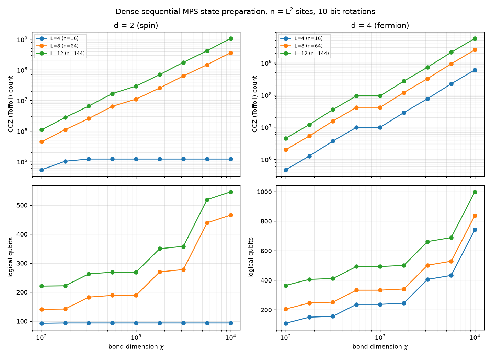

# Benchmarks

## Sequential MPS state preparation

`mps_sequential_estimates.py` computes logical resource estimates for the dense sequential MPS state-preparation circuit. "Dense" means this is not the block-sparse variant. The Q# circuit is in `MPSSequentialEstimate.qs`.

The sweep covers:

- Lattices: square lattices with n = L² sites, L ∈ {4, 8, 12}, ordered as a 1D snake with open boundaries.
- Bond dimensions: χ ∈ logspace(2, 4, 9), i.e. 100 to 10,000.
- Site types: spin sites (d = 2) and fermionic sites (d = 4).
- Rotation precision: 10-bit rotations throughout.

Saved results:

- `mps_sequential_estimates.csv`: logical qubits and CCZ/T/rotation/measurement counts for every (d, L, χ). The `bulk_site_cczCount` column gives the CCZ cost of one bulk site, for extrapolating to other n.
- `mps_sequential_estimates.png`: CCZ count and logical qubits plotted against χ.



To reproduce the results (about 3 minutes), run:

```bash
python mps_sequential_estimates.py              # sweep, write CSV + plot
python mps_sequential_estimates.py --plot-only  # re-plot the saved CSV
python mps_sequential_estimates.py --check      # composed vs. single-trace counts
```

The script needs the `qdk`, `numpy`, and `matplotlib` packages. It compiles the circuit together with the Q# utilities in `qdk_chemistry/utils/qsharp/src` (`GivensDecomposition`, `SelectSwap`, `PhaseGradient`, and `QroamStatePrep` are the ones it uses).

### Model

The circuit is traced shape-only with placeholder rotation data. This works because the non-Clifford cost depends only on the register sizes and on the number of Givens layers per orthogonal factor. The layer counts were calibrated on decompositions of random right-canonical MPS tensors:

- Bonds are min(χ, dⁱ, dⁿ⁻ⁱ). The bond register is padded to 2ᵃ states, where a = ⌈log₂ max bond⌉, at every site.
- For d = 4, the factors W0, W1, and U each need 2ᵃ Clements layers.
- For d = 2, U needs max(χₗ, χᵣ) layers, or a single layer for 2 × 2 blocks.

Against Q# circuits built from real random-tensor decompositions, the CCZ counts agree as follows:

- d = 2: exactly.
- d = 4: within 1.2%.
- Logical qubits: exactly in both cases.

The real-data comparison covered full chains with n = 16 and 36 and χ = 100 to 178.

### Caveats

- **Sign fix-ups are excluded.** The ±1 diagonal fix-ups after each Givens network are gauge-absorbable, so they are left out. On real data they added 3.5–15% CCZ.
- **Costs step at powers of 2.** Because the bond register is padded to 2ᵃ states, costs are piecewise constant in χ for d = 4. For example, χ = 562 and χ = 1000 give the same result.
- **d = 2 at L = 4 saturates.** Its exact bond dimension is at most 2⁸ = 256.
- **Fixed T and rotation counts.** The T count (54) and rotation count (216) come only from preparing the phase-gradient register.
