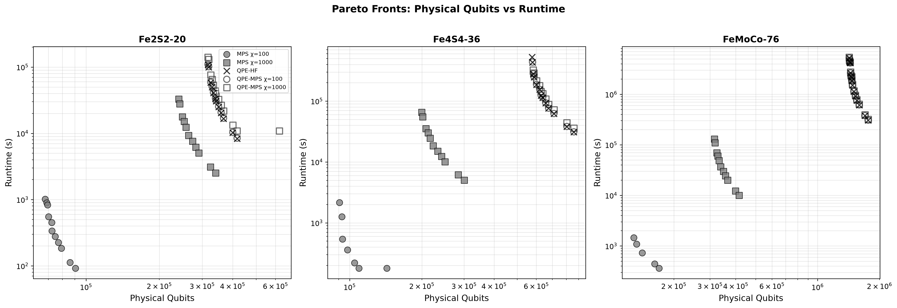
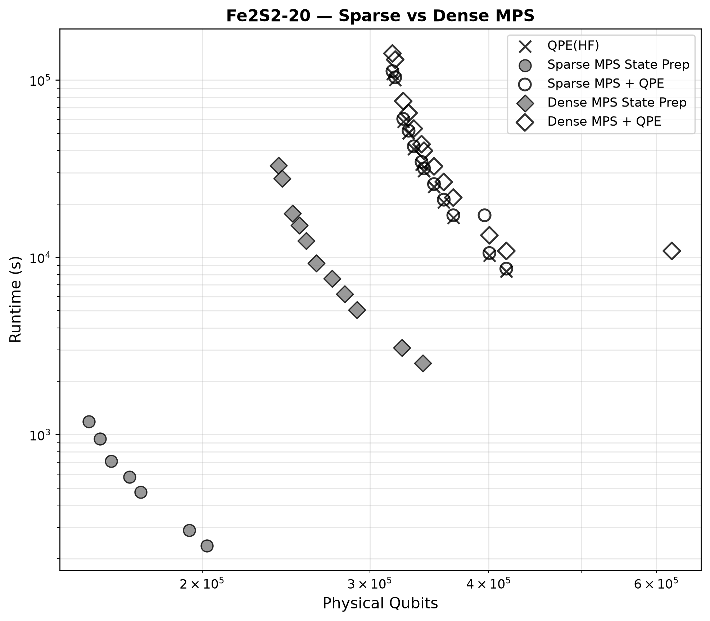

# MPS & SOSSA QPE Resource Estimation

> **Branch:** `scratch/mps_sossa` | **Commit:** `b1e823d370339d912f58fa8e8a239e0eb64e3e2d` (2026-07-07)

This directory contains scripts for resource estimation of MPS state preparation
and SOSSA QPE for selected molecules. Use this branch at the commit
above to reproduce the data presented in the DARPA 2026-07 update.

> **NOTE:** Recommended to run on HPC due to high memory requirements at large
> bond dimensions.

## Prerequisites
You need [Docker](https://docs.docker.com/get-docker/) and
[VS Code](https://code.visualstudio.com/) with the
[Dev Containers](https://marketplace.visualstudio.com/items?itemName=ms-vscode-remote.remote-containers)
extension installed.
**Option A — Extract the tarball in OneDrive**:

```bash
tar -xzf qdk-chemistry-mps-sossa.tar.gz
cd qdk-chemistry
```

**Option B — Clone and checkout from GitHub:**

```bash
git clone https://github.com/microsoft/qdk-chemistry.git
cd qdk-chemistry
git checkout b1e823d370339d912f58fa8e8a239e0eb64e3e2d
```

Then open the repository in the VS Code Dev Container:

1. Open the `qdk-chemistry` folder in VS Code.
2. When prompted, click **"Reopen in Container"** (or use Command Palette →
   "Dev Containers: Reopen in Container").
3. After the container builds, restart VS Code once to load the Python
   virtual environment.

Install dependencies:

```bash
cd python
pip install -e '.[all]'
```

The `[all]` extra pulls in Jupyter, QRE, Qiskit interop, and all optional
backends.

Navigate to the MPS benchmark directory:

```bash
cd ../examples/mps_benchmark
```

## Usage

### Dense MPS resource estimation (random MPS data)

Runs resource estimation scenarios for Fe2S2-20, Fe4S4-36, and FeMoCo-76 using
randomly generated MPS data:

1. SOSSA QPE with Hartree–Fock initial state
2. MPS dense state preparation at various bond dimensions
3. MPS + SOSSA QPE (MPS as initial state for QPE)

```bash
python run_resource_estimation.py --molecules all --bond-dims 100 1000 5000 10000
```

Results are saved as JSON alongside a Pareto-front plot (physical qubits vs
runtime):



### Sparse vs dense MPS comparison (real tensor data)

Compares sparse (U(1)-block-sparsity) and dense (sequential) MPS state
preparation, with optional SOSSA QPE wrapping:

1. SOSSA QPE with HF initial state
2. Sparse MPS state preparation
3. Sparse MPS + SOSSA QPE
4. Dense MPS state preparation
5. Dense MPS + SOSSA QPE

```bash
python run_sparse_vs_dense.py --molecule fe2s2
python run_sparse_vs_dense.py --molecule g1
```



## References

- Berry, D.W. et al. (2025). "Rapid Initial-State Preparation for the Quantum
  Simulation of Strongly Correlated Molecules." PRX Quantum 6, 020327.
  <https://doi.org/10.1103/PRXQuantum.6.020327>
- Rupprecht, F. and Wölk, S. (2026). "Faster matrix product state preparation
  by exploiting symmetry-induced block-sparsity."
  <https://arxiv.org/pdf/2605.28489>. Zenodo:
  <https://zenodo.org/records/20393500>
- Low, G.H. et al. (2025). "Fast Quantum Simulation of Electronic Structure by
  Spectral Amplification." Phys. Rev. X 15, 041016.
  <https://link.aps.org/doi/10.1103/pb2g-j9cw>
