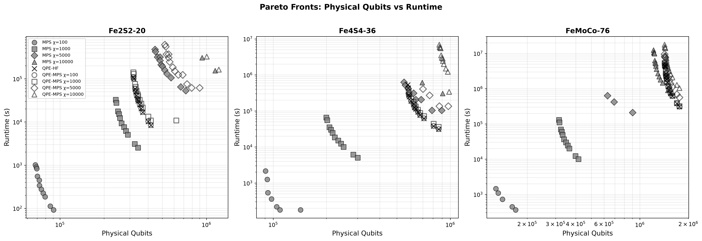
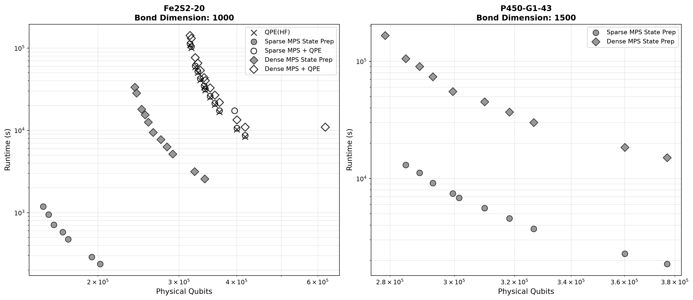

# SOSSA & MPS Resource Estimation with QDK Chemistry

- **Branch:** `scratch/mps_sossa`
- **Commit Hash:** `f3e1c7d` (date: time:)

You can use this branch at this commit hash to reproduce the data presented in "DARPA 2026-07 update".
Recommended to run on HPC due to high memory requirements at large bond
dimensions.

## 1. Setup

Untar the repository, "", or git pull the qdk-chemistry, switch to branch, and checkout the commit hash above. 

Then, open the repository in the VS Code Dev Container.
And install dependencies:

```bash
cd python
pip install -e '.[all]'
```

The `[all]` extra pulls in Jupyter, QRE, Qiskit interop, and all optional backends.

## 2. Run resource estimation for MPS Dense State Preparation

Runs resource estimation scenarios for Fe2S2-20, Fe4S4-36, FeMoCo-76 with randomly generated MPS data:
  1. MPS Dense State Preparation at various bond dimensions
  2. SOSSA QPE with Hartree-Fock initial state
  3. MPS + SOSSA QPE (MPS as initial state for QPE)

```bash
python run_resource_estimation.py --molecules all --bond-dims 100 1000 5000 10000
```

The raw results are in `examples/mps_benchmark/results/` as JSON files. 
Visualize Pareto fronts (physical qubits vs runtime) for all molecules, with one subplot per molecule.



## 3. Run resource estimation for MPS Sparse State Preparation

Runs resource estimation in order:
  1. SOSSA QPE with HF initial state (QPE only)
  2. Sparse MPS State Preparation
  3. Sparse MPS + SOSSA QPE
  4. Dense MPS State Preparation
  5. Dense MPS + SOSSA QPE

```bash  
python run_sparse_vs_dense.py --output my_results.json
```



## References

- Berry, D.W. et al. (2025). "Rapid Initial-State Preparation for the Quantum Simulation of Strongly Correlated Molecules." PRX Quantum 6, 020327. <https://doi.org/10.1103/PRXQuantum.6.020327>
- Rupprecht, F. and Wölk, S. (2026). "Faster matrix product state preparation by exploiting symmetry-induced block-sparsity." <https://arxiv.org/pdf/2605.28489>. Zenodo: <https://zenodo.org/records/20393500>
- Low, G.H. et al. (2025). "Fast Quantum Simulation of Electronic Structure by Spectral Amplification."
Phys. Rev. X 15, 041016. <https://link.aps.org/doi/10.1103/pb2g-j9cw>
